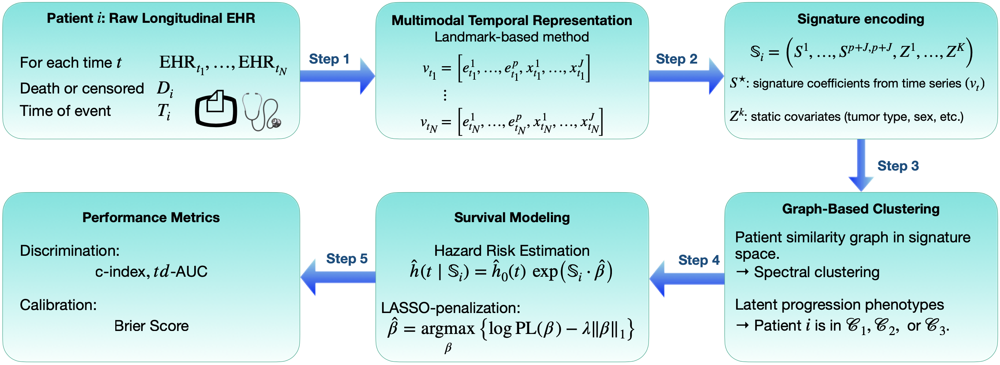

# MultiSigBERT — ECML PKDD 2026 Submission

This repository contains the anonymous implementation of **MultiSigBERT**, a multimodal and temporal survival analysis framework designed for modeling time-to-event outcomes from heterogeneous longitudinal clinical data.

MultiSigBERT combines multimodal embedding extraction, path signature theory, graph-based clustering (Minimum Spanning Tree + spectral methods), and sparse Cox modeling to identify progression phenotypes and estimate patient-specific survival risk.

This repository is provided for reproducibility purposes under the double-blind review policy of ECML PKDD 2026.


## Overview

Electronic Health Records (EHR) contain heterogeneous and time-dependent information, including:

- Narrative clinical reports (free-text),
- Structured numerical variables (e.g., biomarkers, vital signs),
- Static covariates (e.g., demographic or tumor characteristics).

Classical survival models typically rely on static covariates and fail to exploit the geometric and sequential structure of longitudinal multimodal data.

**MultiSigBERT** addresses this limitation through a unified five-stage pipeline:

1. **Multimodal Embedding and Compression**  
   Each modality (textual and structured time-dependent variables) is transformed into vector representations.  
   - Text is encoded via a domain-specific language model.  
   - Sentence embeddings are constructed and compressed using PCA.  
   - Structured longitudinal variables are standardized and temporally aligned.  
   The result is a synchronized multimodal time series for each patient.

2. **Signature-Based Temporal Encoding**  
   The chronological multimodal trajectory is encoded using the path signature transform, producing fixed-dimensional vectors that capture higher-order temporal interactions.

3. **Graph Construction and MST-Based Clustering**  
   Patients are embedded in the learned signature space.  
   A k-nearest neighbor graph is constructed, and its Minimum Spanning Tree (MST) is used to characterize the geometric backbone of inter-patient similarity.  
   Spectral clustering is then applied to identify latent progression phenotypes.

4. **Cluster-Specific Survival Modeling**  
   Within each identified subgroup, a LASSO-regularized Cox proportional hazards model is trained on signature features.

5. **Performance Evaluation**  
   Model performance is assessed using discrimination and calibration metrics (C-index, time-dependent AUC, Brier Score, Integrated Brier Score).


## Pipeline Illustration




## Repository Structure

```
MultiSigBERT/
│
├── data/
│   └── README.md              # Expected dataset format
│
├── models/
│   └── README.md              # Structure for pretrained embedding models
│
├── notebooks/
│   ├── compute_embeddings.ipynb
│   └── multisigbert_study.ipynb
│
├── results/
│   └── descriptive_statistics/
│
├── src/
│   ├── _utils.py
│   ├── compression_pkg.py
│   ├── clustering_pkg.py
│   ├── descriptive_stats_pkg.py
│   ├── metrics_plot_results_pkg.py
│   ├── signature_pkg.py
│   ├── survival_analysis_pkg.py
│   └── sklearn_param_validation_patch.py
│
└── environment.yml
```


## Data Format

The pipeline expects a longitudinal multimodal dataset where:

- Each patient has multiple timestamped observations.
- At each timestamp:
  - Raw clinical text (optional but supported),
  - Structured time-dependent variables.
- Each patient has:
  - Event indicator (0/1),
  - Time-to-event or censoring time,
  - Optional static covariates.

See [data documentation](./data/README.md) for the detailed schema.


## Project Structure

- `data/`: Place your dataset in this folder. To apply the main notebook [`multisigbert_study.ipynb`](./notebooks/multisigbert_study.ipynb) to your data, please refer to the [data format documentation](./data/README.md) for the required structure. 

- `models/`: Store here the pretrained language models (e.g., OncoBERT, CamemBERT, DrBERT, ...) used to extract word embeddings from clinical text. See the [model documentation](./models/README.md) for expected structure and usage.

- `results/`: Contains all output files generated during experiments, including evaluation plots, result CSVs, and descriptive analyses. The subfolder `descriptive_statistics/` provides additional visualizations summarizing the dataset characteristics.

- `src/`: All core methods for preprocessing, model training, evaluation.
  - `_utils.py`: Utility functions for data preprocessing, cohort filtering, censoring simulations, train/test splitting, and full pipeline orchestration (SigBERT end-to-end).
  - `compression_pkg.py`: Implements PCA-based and custom linear projection methods for compressing high-dimensional embeddings into a lower-dimensional space.
  - `descriptive_stats_pkg.py`: Computes basic descriptive statistics and visualizations for longitudinal survival datasets (e.g., report counts, censoring rates).
  - `metrics_plot_results_pkg.py`: Implements evaluation metrics (C-index, td-AUC, Brier Score, IBS) and statistical plots for survival models, including risk stratification and calibration.
  - `sif_embedding_pkg.py`: Implements the SIF embedding method by Arora et al. (2017), including word weighting, PCA projection removal, and full sentence embedding generation.
  - `signature_pkg.py`: Extracts path signature features from time-indexed embedding sequences, with optional log-signatures, Lévy areas, and missing data encoding.
  - `survival_analysis_pkg.py`: Implements all Cox model training procedures using skglm and lifelines, including preprocessing, LASSO regularization, cross-validation, and detailed survival curve plotting.  
  

- `notebooks/`: Jupyter Notebooks to reproduce each major step:
  - `compute_sent_embd.ipynb`: Computes sentence embeddings from clinical texts using either the CLS Token or Arora et al. method (SIF), based on pre-trained word embeddings.
  - The main notebook [`multisigbert_study.ipynb`](./notebooks/multisigbert_study.ipynb) performs:
    - Multimodal embedding extraction and compression
    - Signature computation (configurable truncation order)
    - kNN graph construction and MST-based clustering
    - Spectral clustering in signature space
    - Cluster-specific Cox model training
    - Evaluation (C-index, td-AUC, BS, IBS)


## Setup

### Using Conda

Create the environment:

```bash
conda env create -f environment.yml
```

Activate it:

```bash
conda activate multisigbert-env
```

If needed, update an existing environment:

```bash
conda env update -f environment.yml --prune
```


### Core Dependencies

In addition to standard scientific Python packages (`numpy`, `scipy`, `pandas`, `matplotlib`, `torch`), the implementation relies on:

- `lifelines`
- `scikit-learn`
- `skglm`
- `iisignature`
- `transformers`
- `pynndescent`


### Compatibility Note

`skglm` depends on internal utilities introduced in `scikit-learn >= 1.3`, specifically:

```
sklearn.utils._param_validation.Interval
sklearn.utils._param_validation.StrOptions
```

To ensure compatibility across environments, a lightweight fallback module is injected at runtime before importing `skglm`.

Please see [`sklearn_patch.py`](./src/multisigbert/sklearn_param_validation_patch.py) for the corresponding implementation.


## Important Notes (Double Blind Policy)

- No institutional affiliations are disclosed.
- No dataset source information is provided.
- All identifying metadata has been removed.
- Reported experimental results can be reproduced using appropriately formatted data.

This repository is submitted anonymously for peer review.  
For questions related to the code or reproducibility, please contact: [multisigbert@gmail.com](mailto:multisigbert@gmail.com).